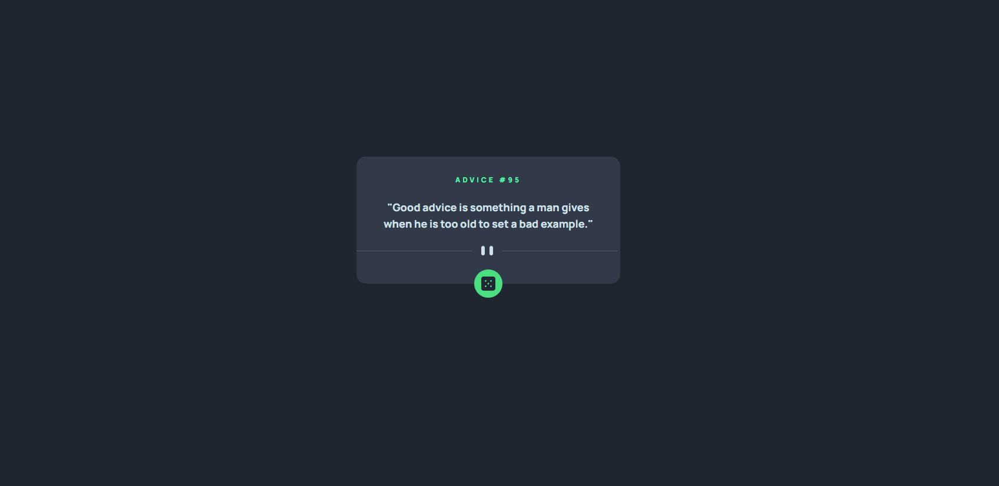

# Frontend Mentor - Advice generator

## Table of contents

- [Overview](#overview)
  - [The challenge](#the-challenge)
  - [Screenshots](#screenshots)
  - [Links](#links)
- [My process](#my-process)
  - [What I learned](#what-i-learned)
  - [Possible upgrades](#possible-upgrades)

## Overview

### The challenge

The challenge concerned building out this advice generator and getting it looking as close to the design as possible.

### Screenshots

### Links

Solution URL: 

## My process

### What I learned

During the challenge, I exercised making axios get requests. I learned how to copy the text to clipboard with a button.
Additionally, I exercised a little bit with dividing the project into React components.

### Possible upgrades

 - Fetching advice by #id from link.
 - Bookmarking favourite advices.
